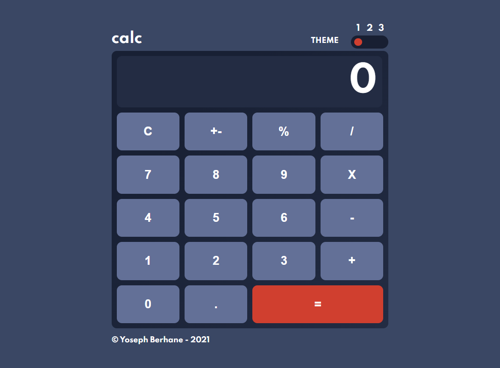

# React - Calculator App

## Welcome to my github page! 👋

Thanks for checking out this calculator app built with React.

## Features

1. Perform mathematical operations like addition, subtraction, multiplication, and division
2. Support decimal values
3. Calculate percentages
4. Invert the values
5. Reset functionality
6. Format larger numbers
7. Output resize based on length

## Installation

1. `git clone https://github.com/isakbet/calculator.git`

2. `cd calculator`

3. `npm install`

4. `npm start`

## Next steps

Users should be able to:

- See the size of the elements based on their device's screen size
- Adjust the color theme based on their preference

## License

The project is under [MIT license](https://choosealicense.com/licenses/mit/).
